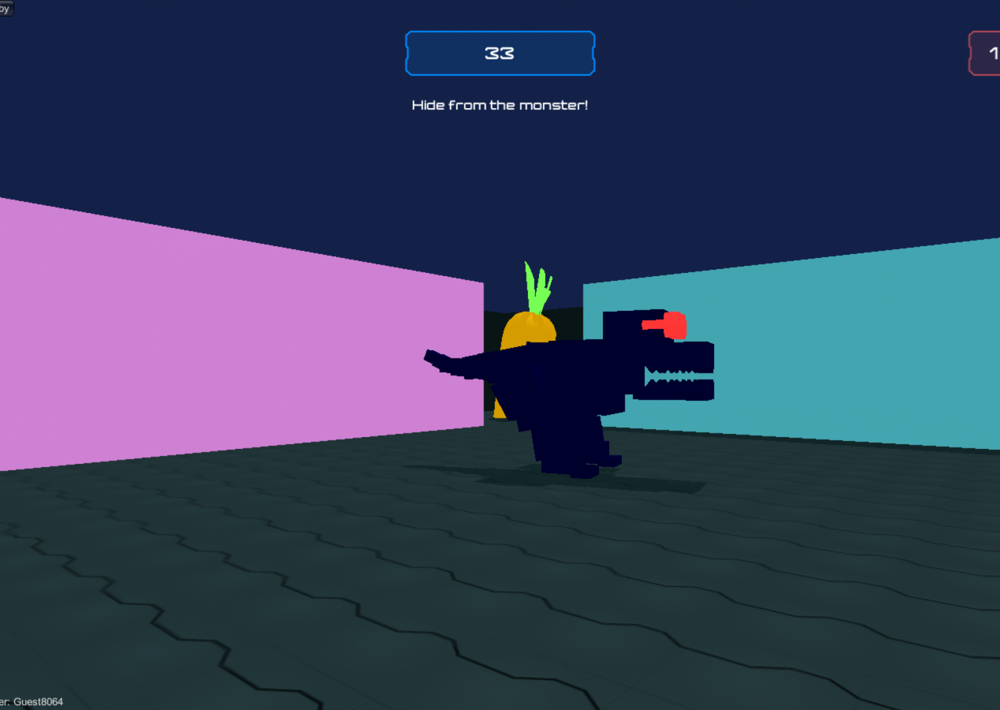
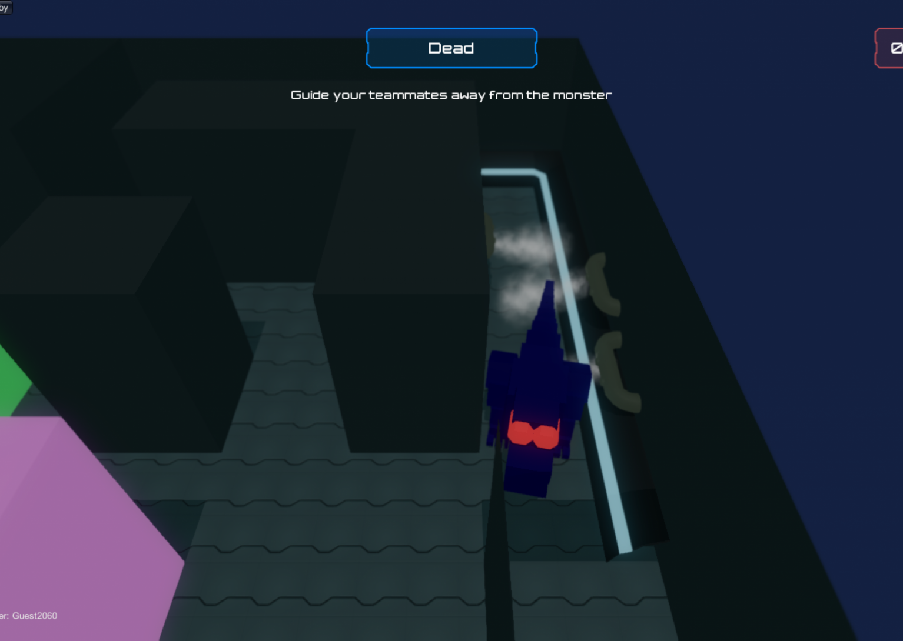
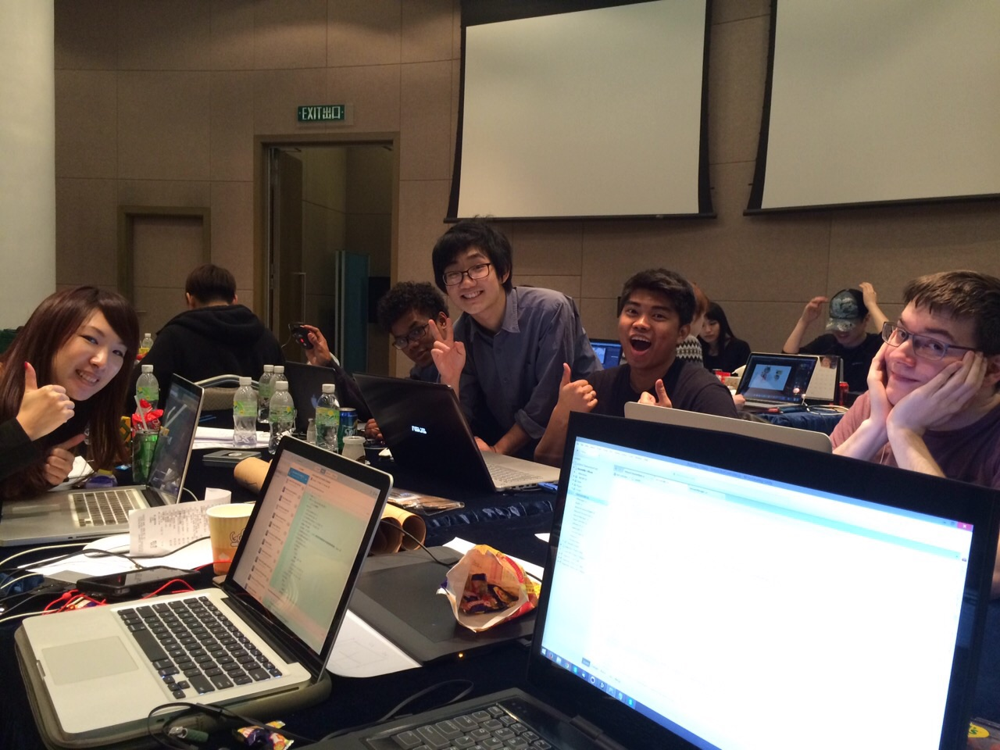
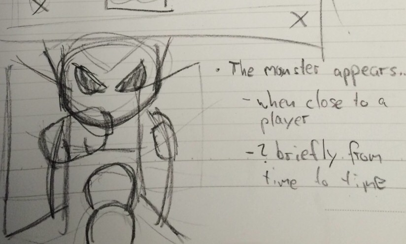
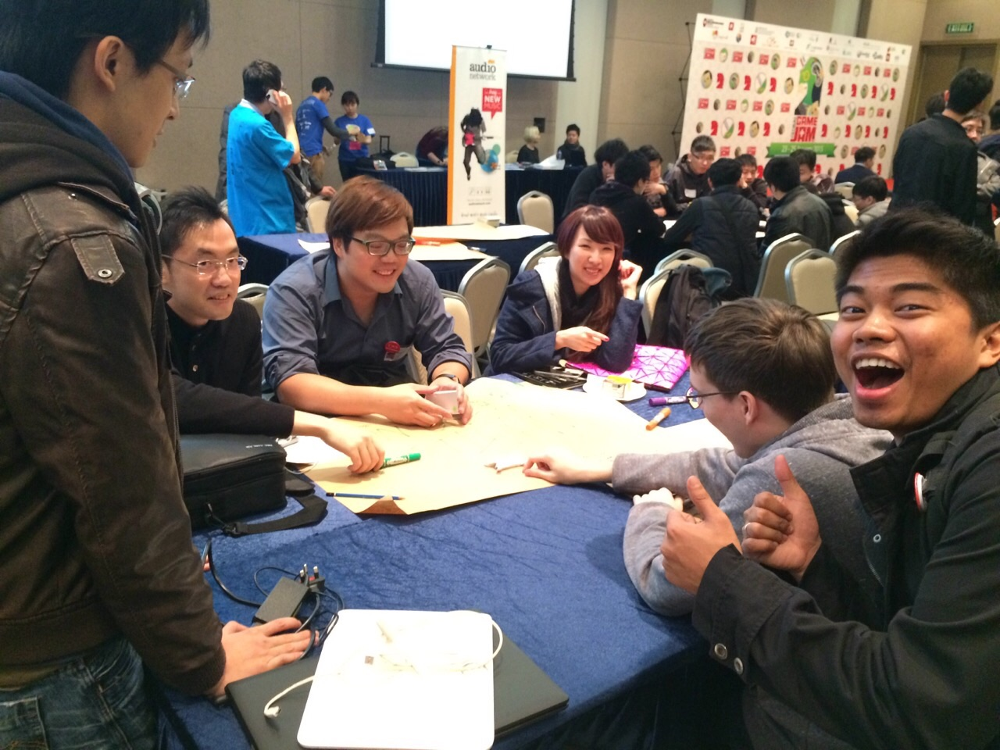
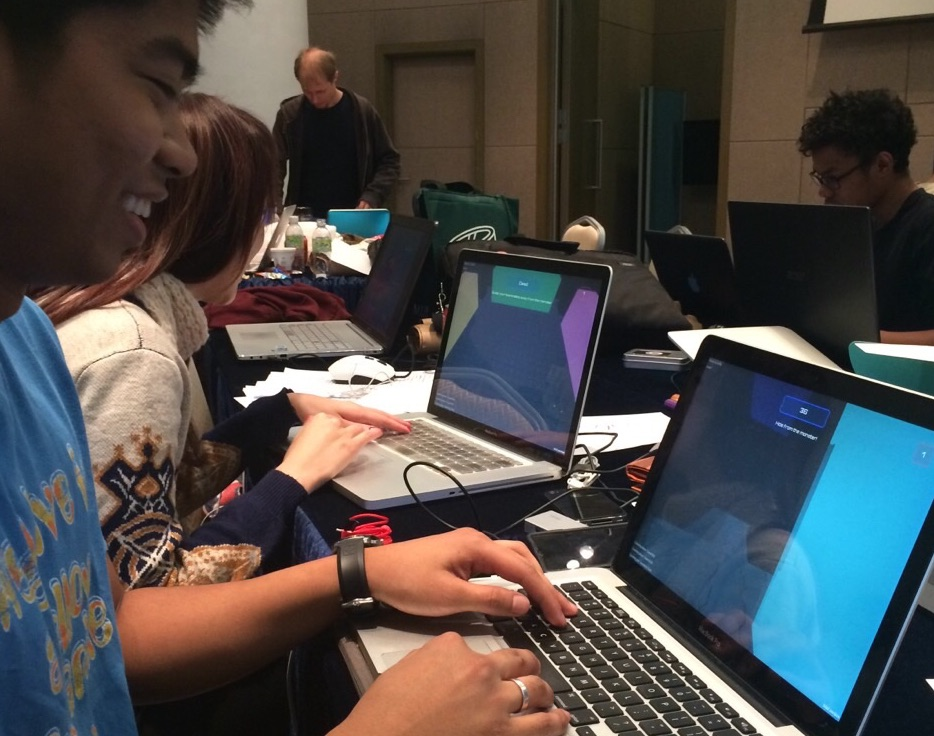
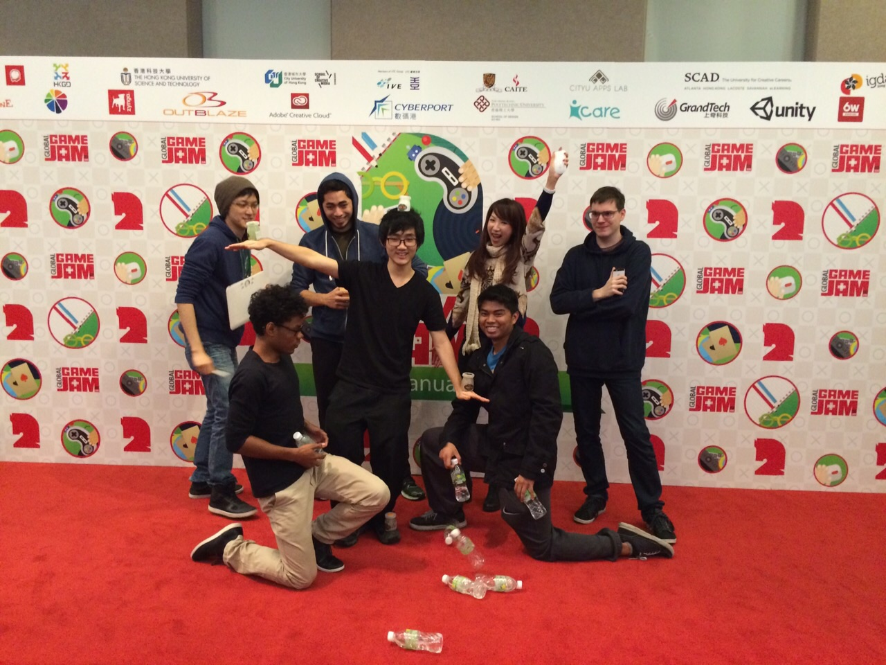

# 

## Factsheet

**Developer:**  
SCAD HK Game Designers

**Founding date:**  
January 1, 2015

**Releases:**  
[exampleproject][example_project]

## Description

A team of game designers in Hong Kong. Students at the Savannah College of Art and Design.

## Premise

TRAPPED is an intense cooperative multiplayer first person shooter game that engages users through thrilling situations and thought provoking cooperation and/or competition. Based on the Global Game Jam 2015 theme “What Do We Do Now?”, players are trapped in a maze with a monster and must help each other to survive. Where is the Monster? What do I do? Where do I go?

A vicious monster is on the loose. It’s fast, it’s scary, and there’s no way to kill it! Players must work together to get through this thrilling chase by updating each other on the monster’s current position. Spectators (newcomers and players who have been caught by the monster) have a full view of the map, the players, and the monster. Will they use this knowledge for good and aid their fellow hunted or will they lead them into a lethal trap?

## Videos

Gameplay Trailer and Playthrough [Youtube](https://www.youtube.com/watch?v=tN-8sHX5130&feature=youtu.be "Trapped Trailer 1")

<iframe src="//www.youtube.com/embed/tN-8sHX5130" frameborder="0" allowfullscreen></iframe>

## Images

download all screenshots & photos as ** [.zip (63 KB)](assets/images/images_gameplay.zip "Images zip") **

## Images

## Logo & Icon

## Awards & Recognition

> * "Winner, Hardcore Category Awards." Global Game Jam 2015, Sunday 25th January, 2015*

## Additional Links

**Company Link #1**  
Link to your company, or some affiliate. Located [here](https://link)

**Company Link #2**  
Another of these. See [here](https://link)

## Team & Repeating Collaborator

**Probably the founder's name goes here**  
[Founder](https://link)

**Another person's name**  
[developer maybe](https://link)

**Another person, show em if you've got em**  
[artist, who knows](https://link)

**A fourth person**  
[music, sound?](https://link)

## Contact

**Inquiries**  
[press-contact@company.com][contact]

**Twitter**  
[twitter.com/companyname][twitter]

** Facebook**  
[facebook.com/companyname][facebook]

**Web**  
[companydomain.com][homepage]

<!--- =====================================================================  -->
<!--- Referenced links -->

[homepage]: http://companydomain.com "Company Name"

[contact]: mailto:press-contact@company.com

<!--- Social -->

[twitter]: https://twitter.com/companyname
[facebook]: https://facebook.com/companyname
[skype]: callto:companyskypename

<!--- Projects  -->

[example_project]: projects/exampleproject/
